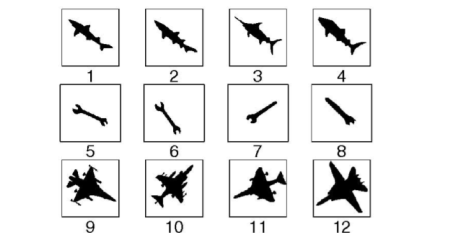
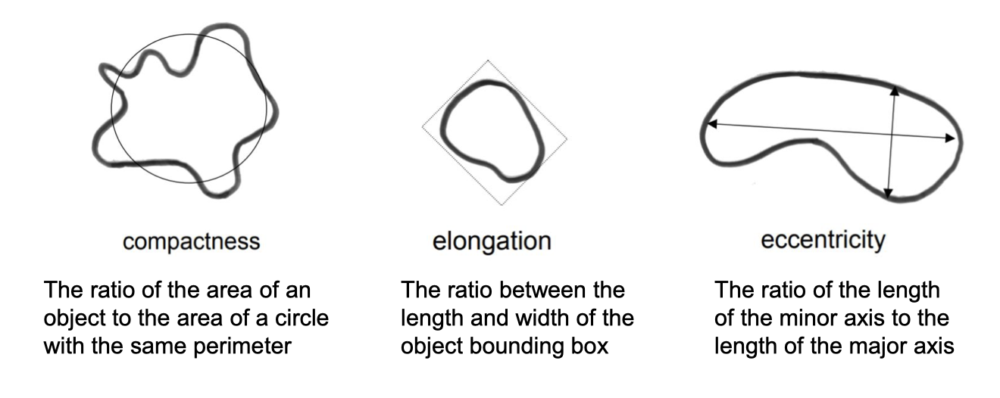

# Week 3 Feature Representation

## Image Features

### What are image features

Image features are essentially vectors that are a compact representation of iamges

Some of intuitive examples of image features:
* corners
* Edges
* Circles, ellipses, lines, blobs etc


### What we can do

Represent images as feature vectors so that further processing can be performed based on these feature vectors

Some of examples of further proessing:
* object detection
    
* segmentation
    
* image classification
    
* content-based image retrieval
    
* image stitching
    

### Properties of features

* Repeatability: Should be detected at the same locations in different images despite changes in viewpoint and illumination.
* Saliency (descriptiveness): Same points in different images should have similar features.
* Compactness: Fewer & smaller features

> WHY NOT use pixel values instead?
>> Pixel values change with light intensity, color and direction. They also change with camera orientation.

### Feature Types

* Color features: Color moments, color histogram
    * Simplest feature to compute
    * Invariant to image transformation (TRS)
    * Example: color-based image retrieval
    * Color moments:
        * Also a way of representing color distribution
        
    * Color histogram:
        * Represent the global distribution of pixel colors in an image
        * Step 1: Construct a histogram for each color channel
        * Step 2: Concatenate the histograms (vectors) of all channels as the final vector
* Texture features: Haralick, LBP, SIFT & feature encoding
    * widely used for identifying visual patterns with properties of hmogeneity that cannot result from the presence of only a **single color** or intensity
    * **Haralick** feature gives an array of statistical descriptiors of image patterns to capture the spatial relationship between pixels (i.e., textures)
        * Step 1: Construct the gray-level co-occurance matrix (GLCM)
            * [GLCM Tutorial](https://prism.ucalgary.ca/handle/1880/51900)
            * [Paper - Image Quality Analysis Using GLCM](https://pdfs.semanticscholar.org/3b72/ac2f79167254697f1d71bf51a8bfbea89e46.pdf)
            * [PPT](http://web.pdx.edu/~jduh/courses/Archive/geog481w07/Students/Hayes_GreyScaleCoOccurrenceMatrix.pdf)
        * Step 2: Compute the Haralick feature descriptors from the GLCM
            * 
            * 
        * Application Example: Commonly used in medical imaging studies due to its simplicity and interpretability.
    * **Local Binary Patterns (LBP)** can be multi-resolution and rotation-invariant
        * LBP describes the spatial structure of local image texture
        * Step 1:
            * Divide the image into cells (normally 16*16 pixels)
            * For each pixel into a cell, compare the pixel to each of its 8 (generate 8-bit binary number) neighbouring pixels: write "0", if pixel's value is greater; write "1", otherwise.
            
        * Step 2:
            * Generate the histogram for all pixels in the cell, computing the frequency of each 8-bit binary number occurring in the cell, giving a 256-dimensional histogram (LBP feature vector)
            * Combine histograms of all cells to obtain the image-level LBP feature descriptor
        * Multi-resolution: varying the distance between the centre pixel and neighbouring pixels, and the number of neighbouring pixels.
        
        * Rotation-invariant: varying the way of constructing the 8-digit binary number, e.g., performing bitwise shift to derive the smallest number, reducing the LBP feature dimension from 256 to 36
        
        * Application Example: Texture classification
    * **Scale-invariant Feature Transform (SIFT)**: Describes the texture features in a localised region around a keypoint. SIFT descriptor is invariant to uniform scaling, orientation, adn partially invariant to affine distortion and illumination changes.
        
        * SIFT Descriptor:
            * 4*4 array (keypoint descriptor) of image gradient histogram weighted by magnitude
            * 8 bins in gradient orientation histogram
            * Total 8\*4*4 array = 128 dimensions
        * Application Example: Image matching
            * Find SIFT keypoints
            * Find best matchikng between SIFT keypoints
        * Descriptor Matching:
            * Nearest Neighbour Distance Ratio
                
        * Application Example: Image stitching
            * Find SIFT keypoints and feature correspondences
            * Find a parametric transformation
        * Transformation
            
        * Fitting and Alignment
            * Lease square fit: most problems in computer vision do not have a simple linear relationship
                ```
                1. Write down objective function
                2. Derived solution
                    a) Compute derivative
                    b) Compute solution
                3. Computational solution
                    a) Write in form Ax=b
                    b) Solve using pseudo-inverse or eigenvalue decomposition
                ```
            * Random sample consensus (RANSAC): starting with too many outliers will prevent convergence to the global optimum, better to find starting set with inlier correspondences, use RANSAC to fit geometric transformaiton to a small subset of all possible matches (supervised learing)
                ```
                1. Sample (randomly) the number of points required to fit the model
                2. Solve for model parameter using samples
                3. Score by the fraction of inliers within a preset threshold of the model
                ```
                
            * Application Example: Texture classification (colored)
    * Feature Encoding: Gloabl encoding of local SIFT features
        * Integrate the local features (i.e., SIFT keypoint descriptors) of an image into a global vector to represent the whole image
        
        * Method Bag-of-Words (BoW): Local image features are encoded into a histogram to represent the overall image feature
            * Step 1: Create the vocabular from the set of local descriptors (e.g., SIFT keypoint descriptor) extractd from the training data. This vocabulary represents the categories of local descriptors.
            * Framework: extract keypoints -> feature descriptors -> clustering (k-means clsutering) -> vocabulary -> visual words
                ```
                K-means clustering:
                1. Assign data (i.e., feature vectos) to the closest cluster - based on the Euclidean distance between feaure vectors $|| x_1 - x_2 ||$
                2. Update cluster centre as the mean of data samples in this cluster
                ```
            * Step 2: The cluster centres become the "vocabularies", i.e., a set of "visual words". Individual local feature descriptor (e.g., SIFT keypoint descriptor) is assigned to one visual word with the smallest distance.
            * Framework: image -> approximate nearest neighbour -> feaure histogram -> feature vector
            * Application Example: SIFT-based texture classification
            
            > * Note the feature descripto does not restrict in SIFT, but can be LBP, SURF etc.
            > * Other tecniques other than BoW: VLAD, Fisher Vector
            * [Reference](http://www.vlfeat.org)
* Shape features: Basic, shape context, HOG
    * Shape is an essential feature of most real-world objects, and can be used to identify an object or region as a meaningful geometric form.
    * Application Example: Object recoginition given shape
    * Shape features in an image are normally represented after the image has been segmented into objects or regions
        
    * Challenges includes invariance to rigid transformations, tolerance to non-rigid deformations and correspondence unknown
    * Simple geometric shape descriptors:
        
    * Boundary Descriptors
        * **Chain code**: All simple directions are represented by a 3*3 cell. The outlier rasterised shape is represented by a sequence of integers defined in the cell.
            
        * **Radial distance measures**: The centroid of the shape is used as the centre point, and the radial distance is computed for all N pixels along its boundary. To achieve scale invariance, d(n) is normalised by the maximum distacne to obtain the normalised radial distance r(n) - the number of times the signal r(n) crosses its mean - can be used to measure boundary roughness.
            
            * Application Example: Longittudinal brian tumor analysis
        * **Shape Context**: A point-wise local feature descriptor
            * Pick n points on the contours of a shape
            * Foreach point $p_i$, a histogram $h_i$ of the relative coordinates of the n-1 points is constructed
            
            * Application Example: Shape matching
            * Step 1: Sample a list of points on shape edges
            * Step 2: Compute the shape context for each point
            * Step 3: Compute the cost matrix
            * Step 4: Find the one-to-one matching that minimises the total cost between pairs of points on the two shapes
            * Step 5: Transform or deform one shape to the other based on the previous one-to-one point matching
            * Step 6: Compute the shape distance, shape context distance, appearance cost and transformation cost
        * **Histogram of Oriented Gradients (HOG)**: Describes the distributions of gradient orientations in localised areas, and does not require initial segmentation
            * Step 1: Calculate gradient magnitude and orientation at each pixel with a gradient operator, gradient vector
            * Step 2: Divide orientations into N bins; the gradient magnitude of each pixel is then voted into the bin corresponding to its orientation, cell histogram
            * Step 3: Block normalisation and concatenate cell histograms to generate image window-level HOG descriptor
            * Detection via sliding window on the image
            * Application Example: Human detection/Deformable part model
## General Framework

```
Image Pre-processing
        |
Feature Representation      \
        |                    - Deep Learning
Pattern Recognition         /
        |
Post-processing
```
